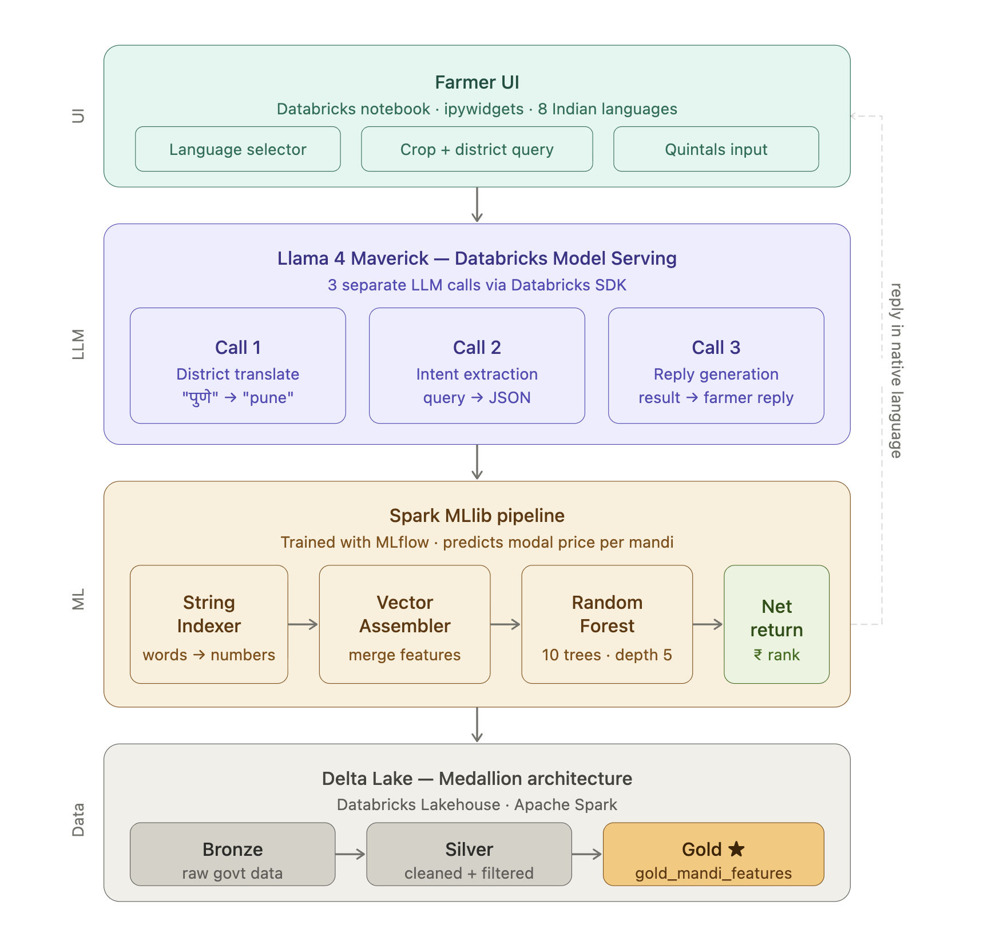

# Bharat-Bricks-2026-Hackathon
# 🌾 Mandi Mitra — AI Agricultural Market Advisor

> Mandi Mitra is a multilingual AI chatbot that helps Indian farmers find the **best mandi (market)** to sell their crop at the highest price. Built on Databricks using Spark MLlib for price prediction and Llama 4 Maverick for natural language understanding — supporting 8 Indian languages.

---

## Architecture Diagram



---

## What it Does

Mandi Mitra takes a farmer's question in their native language (e.g., *"मला पुण्यात कांदा विकायचा आहे"*), identifies the crop and district using Llama 4, runs a trained Random Forest model to predict prices at every mandi in that district, and replies in the farmer's language with the top mandi recommendation and estimated profit.

**Supported crops:** Tomato, Onion, Potato, Wheat

**Supported languages:** English, Hinglish, Hindi, Tamil, Telugu, Marathi, Bengali, Punjabi

---

## Databricks Technologies Used

| Technology | Usage |
|---|---|
| Databricks App / Notebook UI | Frontend chatbot interface |
| Delta Lake (Gold table) | Stores cleaned, feature-rich mandi price data |
| Apache Spark | Distributed data processing and ML inference |
| Spark MLlib | Random Forest price prediction pipeline |
| MLflow | Experiment tracking — logs RMSE, MAE, params, model |
| Databricks Model Serving | Hosts Llama 4 Maverick as live LLM endpoint |
| Databricks SDK (`WorkspaceClient`) | Calls LLM endpoint from Python |

**Open-source model:** `meta-llama/llama-4-maverick` via `databricks-llama-4-maverick` endpoint

---

## How to Run

### Prerequisites

- Databricks workspace with Unity Catalog enabled
- Access to `databricks-llama-4-maverick` model serving endpoint
- Cluster with Spark 3.x and DBR 13.x or above
- `databricks-sdk` installed on cluster

### Step 1 — Clone the repo

```bash
git clone https://github.com/<your-username>/mandi-mitra.git
```

### Step 2 — Import notebooks into Databricks

1. Go to your Databricks workspace
2. Click **Workspace → Import**
3. Upload the following notebooks in order:
   - `01_bronze_ingestion.py`
   - `02_silver_cleaning.py`
   - `03_gold_features.py`
   - `04_train_model.py`
   - `05_chatbot_ui.py`

### Step 3 — Run notebooks in order

Run each notebook top to bottom on a cluster. Notebooks 01–03 build the Delta Lake tables. Notebook 04 trains and logs the Random Forest model via MLflow. Notebook 05 launches the chatbot UI.

```
Run 01 → Run 02 → Run 03 → Run 04 → Run 05
```

### Step 4 — Launch the chatbot

In notebook `05_chatbot_ui.py`, run **Cell 5** (labelled `# ===== CELL 5: Mandi Mitra =====`).

The UI will render directly below the cell with:
- A language dropdown
- A chat input box
- A district and quintal input

---

## Demo Steps

Follow these steps to reproduce the demo:

1. **Open** notebook `05_chatbot_ui.py` and run Cell 5
2. **Select language** — choose `हिन्दी` from the dropdown
3. **Enter district** — type `pune` in the district field
4. **Enter quintals** — set to `10`
5. **Type query** — paste: `पुण्यात टोमॅटो कुठे विकावा?`
6. **Click Send** — the chatbot will reply in Hindi with the best mandi name, predicted price per quintal, and estimated profit
7. **Switch language** — change dropdown to `English`, type: `Where should I sell onion in Nashik?`
8. **Observe** — reply switches language automatically

### Expected output (example)
```
🤖 Nira mandi in Pune offers the best price for tomatoes at ₹1,842/quintal.
   For 10 quintals, your estimated profit is ₹18,170. Jai Kisan!
```

---

## MLflow Metrics (Bonus)

After running notebook `04_train_model.py`, open the **MLflow Experiments** tab in Databricks to view:

| Metric | Value |
|---|---|
| RMSE | ~logged automatically |
| MAE | ~logged automatically |
| numTrees | 10 |
| maxDepth | 5 |

---

## Project Write-up

> Mandi Mitra is a multilingual AI chatbot for Indian farmers that predicts the best mandi to sell their crop at the highest price. Built on Databricks using Spark MLlib for price forecasting and Llama 4 Maverick for multilingual intent extraction and reply generation. Supports 8 Indian languages. Uses a Gold Delta Lake table with weather and harvest season features. Farmers simply ask in their native language and get an instant, actionable mandi recommendation with estimated profit.

---

## Team

Built at **Bharat Bricks Hacks 2026 — IIT Delhi**
